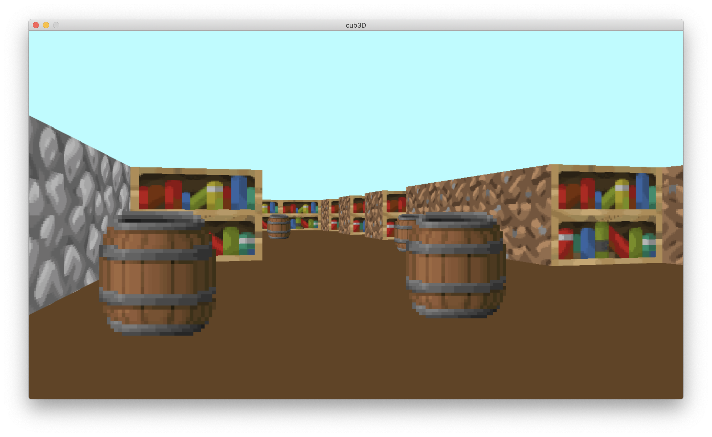
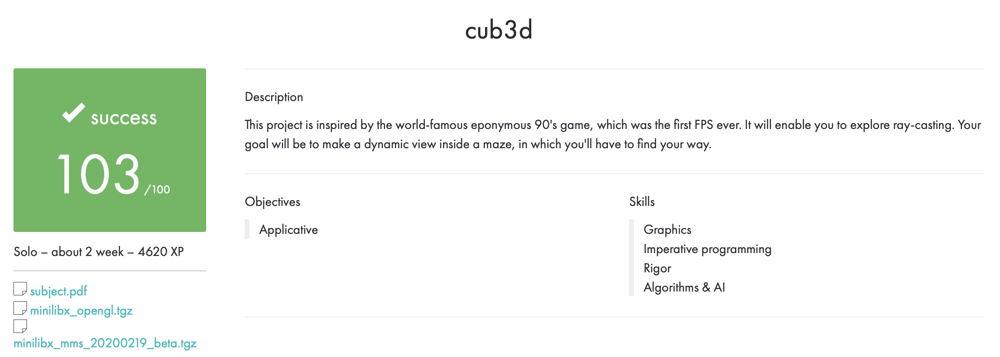

# cub3D

## Description

Repeat raycasting in Wolfenstein 3D, using the miniLibX library. The main task: to explore the path of the rays, to make a dynamic view inside the maze.

The compilation was performed as follows: ``gcc -Wall -Wextra -Werror *.o -L. -lmlx -lft -framework OpenGL -framework AppKit -o cub3d``.

All files pass to ``Norminette``.

No memory leaks.

  

## Using

``make`` and ``make all`` compile the library ``libfе.a`` and ``libmlx.dylib``, placing them in the root folder.

``make re`` deletes all ``.o`` files, deletes ``libfе.a`` and ``libmlx.dylib``, rebuilds the project.

``make clean`` deletes all ``.o`` files.

``make fclean`` deletes all ``.o`` files, also deletes ``libfе.a`` and ``libmlx.dylib``.

Starting the program: ``./cub3D [map.cub]``.

Take a screenshot: ``./cub3D [map.cub] --save``.

## Configuration file map.cub

This file is given as first argument to a program and contains info about:

* Screen resolution
* Notrh, South, East, West textrures for walls and sprite in .xpm files
* Ceiling and floor color in RGB format
* Map where 1 - wall, 0 - empty space, N/W/E/S - initial direction of a player, 2 - sprite

## Checking the validity of map.cub

If any misconfiguration of any kind is encountered in the file, the program must exit properly and return "Error\n" followed by an explicit error message. Some of requirements are subjective.

## my_test

Insert the code from ``tests.c`` in ``main.c``, compile and look at the result.

## Evaluation

